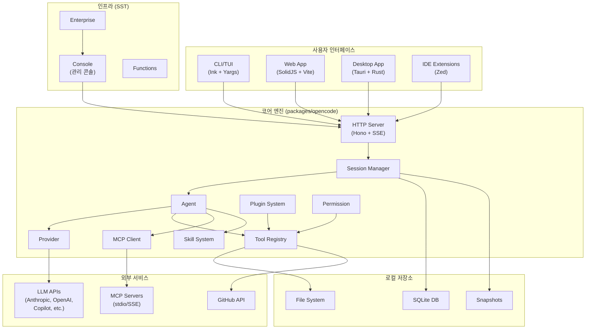
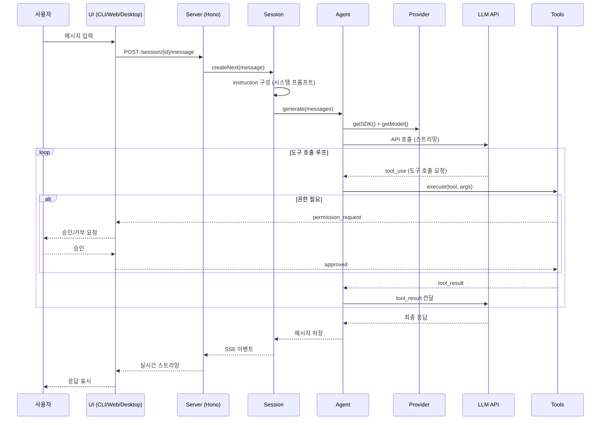
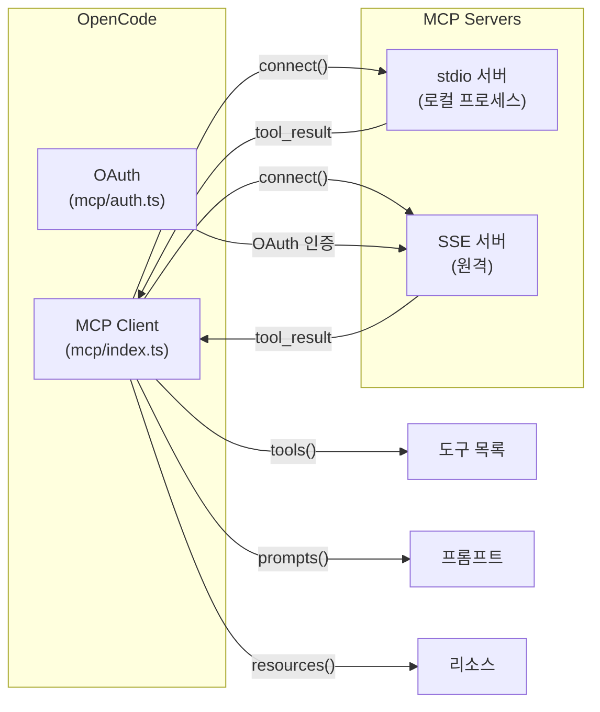
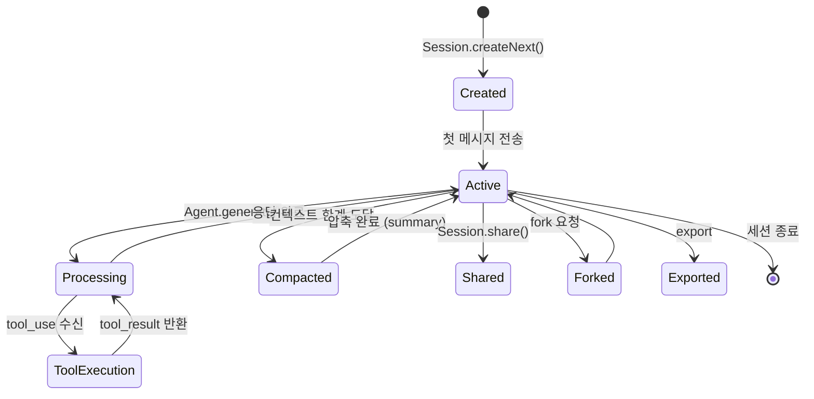

# OpenCode - Project Flow

### 1. 전체 시스템 아키텍처

```mermaid
graph TB
    subgraph UI["사용자 인터페이스"]
        CLI["CLI/TUI<br/>(Ink + Yargs)"]
        WEB["Web App<br/>(SolidJS + Vite)"]
        DESK["Desktop App<br/>(Tauri + Rust)"]
        IDE["IDE Extensions<br/>(Zed)"]
    end

    subgraph CORE["코어 엔진 (packages/opencode)"]
        SERVER["HTTP Server<br/>(Hono + SSE)"]
        SESSION["Session Manager"]
        AGENT["Agent"]
        PROVIDER["Provider"]
        TOOLS["Tool Registry"]
        MCP_CLIENT["MCP Client"]
        PLUGIN["Plugin System"]
        SKILL["Skill System"]
        PERM["Permission"]
    end

    subgraph EXTERNAL["외부 서비스"]
        LLM["LLM APIs<br/>(Anthropic, OpenAI,<br/>Copilot, etc.)"]
        MCP_SERVER["MCP Servers<br/>(stdio/SSE)"]
        GH["GitHub API"]
    end

    subgraph INFRA["인프라 (SST)"]
        CONSOLE["Console<br/>(관리 콘솔)"]
        ENT["Enterprise"]
        FUNC["Functions"]
    end

    subgraph STORAGE["로컬 저장소"]
        SQLITE["SQLite DB"]
        FS["File System"]
        SNAP["Snapshots"]
    end

    CLI --> SERVER
    WEB --> SERVER
    DESK --> SERVER
    IDE --> SERVER

    SERVER --> SESSION
    SESSION --> AGENT
    AGENT --> PROVIDER
    AGENT --> TOOLS
    AGENT --> MCP_CLIENT
    AGENT --> SKILL

    PROVIDER --> LLM
    MCP_CLIENT --> MCP_SERVER
    TOOLS --> FS
    TOOLS --> GH
    PLUGIN --> TOOLS

    SESSION --> SQLITE
    SESSION --> SNAP
    PERM --> TOOLS

    CONSOLE --> SERVER
    ENT --> CONSOLE
```

### 2. 사용자 요청 처리 흐름

```mermaid
sequenceDiagram
    participant U as 사용자
    participant UI as UI (CLI/Web/Desktop)
    participant S as Server (Hono)
    participant SS as Session
    participant A as Agent
    participant P as Provider
    participant LLM as LLM API
    participant T as Tools

    U->>UI: 메시지 입력
    UI->>S: POST /session/{id}/message
    S->>SS: createNext(message)
    SS->>SS: instruction 구성 (시스템 프롬프트)
    SS->>A: generate(messages)
    A->>P: getSDK() + getModel()
    A->>LLM: API 호출 (스트리밍)

    loop 도구 호출 루프
        LLM-->>A: tool_use (도구 호출 요청)
        A->>T: execute(tool, args)

        alt 권한 필요
            T-->>UI: permission_request
            UI-->>U: 승인/거부 요청
            U-->>UI: 승인
            UI-->>T: approved
        end

        T-->>A: tool_result
        A->>LLM: tool_result 전달
    end

    LLM-->>A: 최종 응답
    A-->>SS: 메시지 저장
    SS-->>S: SSE 이벤트
    S-->>UI: 실시간 스트리밍
    UI-->>U: 응답 표시
```

### 3. MCP 연동 흐름

```mermaid
graph LR
    subgraph OPENCODE["OpenCode"]
        MC["MCP Client<br/>(mcp/index.ts)"]
        AUTH["OAuth<br/>(mcp/auth.ts)"]
    end

    subgraph MCP_SERVERS["MCP Servers"]
        STDIO["stdio 서버<br/>(로컬 프로세스)"]
        SSE_SRV["SSE 서버<br/>(원격)"]
    end

    MC -->|"connect()"| STDIO
    MC -->|"connect()"| SSE_SRV
    AUTH -->|"OAuth 인증"| SSE_SRV
    MC -->|"tools()"| TOOLS_OUT["도구 목록"]
    MC -->|"prompts()"| PROMPTS_OUT["프롬프트"]
    MC -->|"resources()"| RES_OUT["리소스"]

    STDIO -->|"tool_result"| MC
    SSE_SRV -->|"tool_result"| MC
```

### 4. 세션 생명주기

```mermaid
stateDiagram-v2
    [*] --> Created: Session.createNext()
    Created --> Active: 첫 메시지 전송
    Active --> Processing: Agent.generate()
    Processing --> ToolExecution: tool_use 수신
    ToolExecution --> Processing: tool_result 반환
    Processing --> Active: 응답 완료
    Active --> Compacted: 컨텍스트 한계 도달
    Compacted --> Active: 압축 완료 (summary)
    Active --> Shared: Session.share()
    Active --> Forked: fork 요청
    Forked --> Active
    Active --> Exported: export
    Active --> [*]: 세션 종료
```
